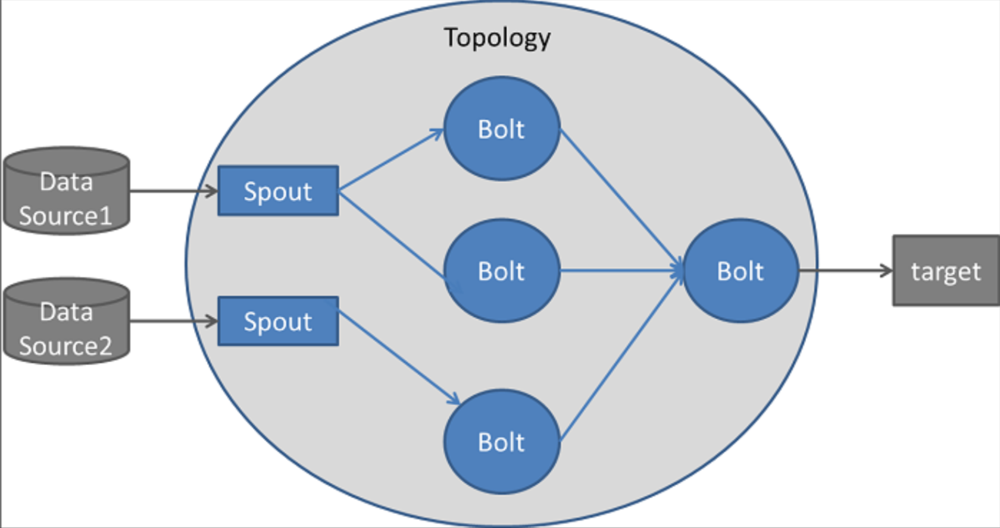

# Storm

Apache Storm is a **distributed stream processing computation framework**. Storm provides **realtime computation**.

## Architecture
The Apache Storm cluster comprises following critical components:
- **Nodes**: There are two types of nodes: Master Nodes and Worker Nodes. A **Master Node** executes a daemon Nimbus which assigns tasks to machines and monitors their performances. On the other hand, a **Worker Node** runs the daemon called Supervisor which assigns the tasks to other worker nodes and operates them as per the need. As Storm cannot monitor the state and health of cluster, it deploys **ZooKeeper** to solve this issue which connects Nimbus with the Supervisors.
- **Components**: Storm has three critical components: Topology, Stream, Spout and Bolts.
	- **Topology** is a network made of Stream and Spout.
    - **Stream** is an unbounded pipeline of tuples.
    - **Spout** is the source of the data streams which converts the data into the tuple of streams and sends to the bolts to be processed.
    - **Bolts**: Processes input streams and produces new streams: can implement functions such as filters, aggregation, join, etc

### Stream Grouping
- **Shuffle grouping**: pick a random task
- **Fields grouping**: consistent hashing on a subset of tuple fields
- **All grouping**: send to all tasks
- **Global grouping**: pick task with lowest id