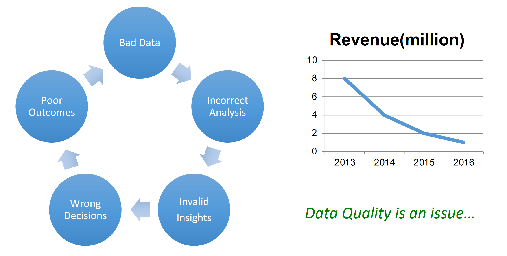

# 01 The challange and importance of data wrangling

The step after Data Acquisition and before Analysis in the data management
flow is Data Wrangling, also called Data Cleaning or Data Preparation.

In this step data is cleaned, tested and prepared to be the best input possible
for the analysis process. In other words,we need to ensure that our data has high
quality, which is a property defined by this metrics:
- **Accuracy**: The data was recorded correctly.
- **Completeness**:All relevant data was recorded.
- **Uniqueness**:Entities are recorded once.
- **Timeliness**: The data is kept up to date (and time consistency is granted).
- **Consistency**: The data agrees with itself.

Unfortunately it isn’t easy to measure and define these metrics. In fact, these metrics could be:
- **Unmeasurable**: Accuracy and completeness are extremely difficult, per-
haps impossible to measure.
- **Context independent**: No accounting for what is important. E.g., if you
are computing aggregates,you can tolerate a lot of inaccuracy.
- **Incomplete**: What about interpretability, accessibility, metadata, analysis,
etc.
- **Vague**: The conventional definitions provide no guidance towards practi-
calimprovements of the data.

For these reasons data wrangling is often the most crucial, difficult and predominant task of a data scientist/engineer.

If the data wrangling step is done poorly, it may lead to analysis being run on
bad data which could in turn lead to bad decision making in company and bad
business.

