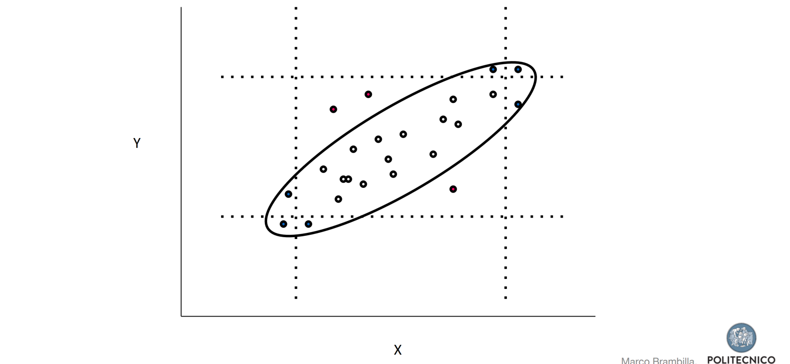

# 02 Data Wrangling Process

Data Wrangling is the process of transforming “raw” data into data that can be
analyzed to generate valid actionable insights.

In order to transform raw unreliable data into refined high quality material alot of improvements of the traditional **ETL (Extract-Transform-Load) approach** by adding more steps
that test and improve the quality raw data.

The process steps are:
- **Understand**: data is to be understood deeply, having a better idea about what the data is
about
- **Explore and Structure**: raw data is given in a random manner, and in most cases there
will not be any structure to it. The data needs to be restructured in a manner that better
suits the analytical method used.
- **Transform**: all datasets are sure to have some outliers, which can skew the results of the
analysis. These will have to be cleaned to obtain an high-quality analysis. Moreover null
values will be have to be changed (using specific techniques like padding), and the formatting
will be standardized in order to make the data of higher quality
- **Augment/Enrich**: after cleaning it, it will have to be enriched, meaning that you may need
to use some additional data in order to make it better
- **Shape**: the prepared wrangled data is published using an agreed format so that it can be
used further down the line

## Data cleansing
Data cleansing or data scrubbing is the act of
detecting and correcting (or removing) corrupt or
inaccurate records from a data set.

The term refers to identifying incomplete, incorrect, inaccurate, partial or irrelevant parts of the data and then replacing, modifying, filling in or deleting this
dirty data (when it’s just too noisy to be fixed).

But what does it mean to have dirty data? to give you an idea,here are some
examples:
- Dummy Values
- Absence of Data
- Multipurpose Fields
- Cryptic Data
- Contradicting Data
- Shared Field Usage
- Inappropriate Use of Fields
- Violation of Business Rules
- Reused Primary Keys
- Non-Unique Identifiers
- Data Integration

In practice:
- **Parsing**: converted from some kind of raw format (often plain text) to a more formal
structure.
- **Correcting**: corrects parsed individual data
components using sophisticated data
algorithms and secondary data sources.
- **Standardizing**: applies conversion routines to
transform data into its preferred (and consistent)
format using both standard and custom business
rules, as well as coherent measurement units, ...
- **Matching**: Searching and matching records within and
across the parsed, corrected and
standardized data based on predefined
business rules to eliminate duplications.
- **Consolidating**: Analyzing and identifying relationships
between matched records and
consolidating/merging them into ONE
representation.

## Handling Missing Data
There are a lot of strategies to detect missing data:
- Match data specifications against data - are all the
attributes present?
- Scan individual records - are there gaps?
- Rough checks : number of files, file sizes, number of
records, number of duplicates
- Compare estimates (averages, frequencies, medians) with
“expected” values and bounds

There can be many reason for missing data: source system faults, ingestion errors (e.g. wrong schema), data who is partial by nature (like empty forms).

We can deal with these kind of situations in a number of ways:
- When there’s a field missing, **delete** the entire record. This solution is very
risky as can lead to losing big quantities of data and should therefore not
be used if there’s an alternative.
- **Fill missing fields with estimators like the average**. This method is conve-
nient and simple but it assumes that the data distribution between records
is uniform and ignores possible bias which could influence the result.
- **Fill missing fields with more accurate algorithms based on attribute rela-
tionships**: Regression (linear, ...), Propensity Score, ...
- Use more complex methods like **Markov Chain Monte Carlo** who calculate
the field by analyzing pattern in other records.

## Handling outliers
Rcords who have values completely outside of the data distribution which need to be eliminated.
There are many techniques for detecting outliers, the simples of which is plotting
with control charts.

## Types of data
- Categorical
- Qualitative
- Quantitative
	- Discrete
    - Continuous
    
## “Key” (matching) problem
When we need to identify the same resource
coming from different sources